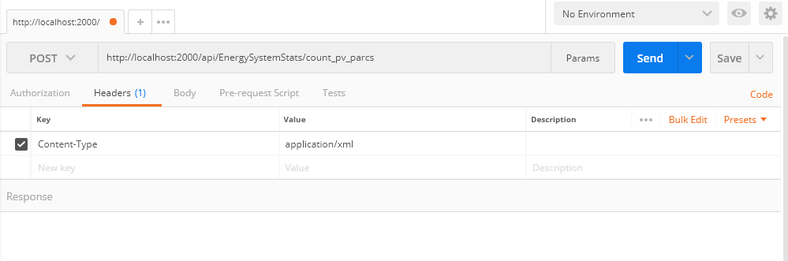
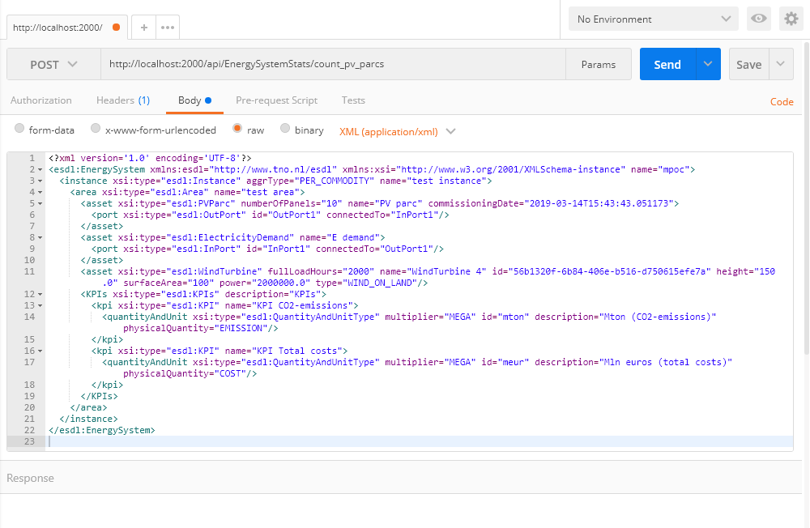
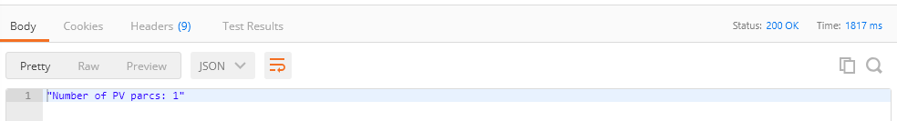

# ESDL-flask-server
An example webservice that parses ESDL and calculates some statistics (Number of PVParcs)

# Installation

Installation steps:
- Clone this git repository
- Install dependencies `pip install -r requirements.txt`
- start the application `app.py`

# Usage

Use for example [Postman](https://www.getpostman.com/downloads/) to generate an HTTP POST request

- body must contain the ESDL energy system description
- headers: Content-Type: application/xml

# Example

## Request header

## Request body

## Result

